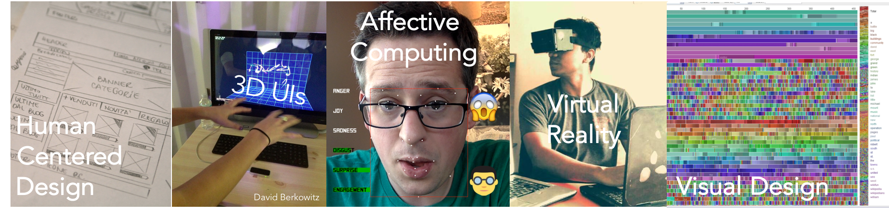

---
# You don't need to edit this file, it's empty on purpose.
# Edit theme's home layout instead if you wanna make some changes
# See: https://jekyllrb.com/docs/themes/#overriding-theme-defaults
layout: home
---

## Why the _Human_ is first in Human-Computer Interaction
For computer scientists, the word _design_ is too often used exclusively in the context of code and architecture. The result of this narrow perspective is that engineers have a habit of building complex, intricate products that are wonderfully functional, but never used. When they _are_ used, neglecting people in your design can lead to unexpected consequences that range from clumsiness to discrimination for individuals, groups, or cultures.

In this course, we will study both people and technology to  understand the behavior that computers encourage or constrain. Through a variety of modalities (chatbots, 3D user interfaces, visualization, etc), we will deliberately practice processes that result in useful, usable, and maybe even inspirational computer interfaces.  

- **Who:** Prof. [Evan Peck](http://www.eg.bucknell.edu/~emp017/)
- **Where:** Dana 132
- **When:** 9:30 - 10:52am, Tuesday/Thursday

## Resources
- [Course Syllabus](docs/syllabus.html)
- [Reading Schedule](docs/schedule.html)
- [Design Doc Instructions](docs/designdocs.html)
- [Slack Group](https://bucknellhcifall2017.slack.com/) \| [Sign Up](https://bucknellhcifall2017.slack.com/signup)
- [Design Resources](docs/resources.html)

## Designing
_For examples of student work, see our [CSCI379 publication](https://medium.com/bucknell-hci/tagged/csci379-hci) page on [Bucknell HCI](https://medium.com/bucknell-hci)_

- [Good Design, Bad Design](designs/goodbad_assn.html) **-->** [submit](https://gitlab.bucknell.edu/bucknell-hci/bucknell-hci-fa2017/wikis/goodbad_assn) \| _Due 8/31, 9:30am_
- [Design for Others](designs/visual_assn.html) **-->** [submit](https://gitlab.bucknell.edu/bucknell-hci/bucknell-hci-fa2017/wikis/design-for-others) \| _Demo 9/12_ \| _Doc 9/14_
- [Design for Understanding](designs/datavis_assn.html) **-->** [submit](https://gitlab.bucknell.edu/bucknell-hci/bucknell-hci-fa2017/wikis/design-for-understanding) \| _Demo 9/26_ \| _Doc 9/28_
- [Design for Tension](designs/chatbot_assn.html) **-->** [submit](https://gitlab.bucknell.edu/bucknell-hci/bucknell-hci-fa2017/wikis/design-for-tension) \| _Demo 10/12_ \| _Doc 10/15 (11pm)_
- [Design for Fun](designs/gesture_assn.html) **-->** [submit](https://gitlab.bucknell.edu/bucknell-hci/bucknell-hci-fa2017/wikis/design-for-fun) \| _10/26_ \| _10/29_
- [Design for Wellbeing](designs/emotion_assn.html) **-->** [submit](https://gitlab.bucknell.edu/bucknell-hci/bucknell-hci-fa2017/wikis/design-for-wellbeing) \| _11/09_ \| _11/12_
- [Design for Another World](designs/vr_assn.html) **-->** [submit](https://gitlab.bucknell.edu/bucknell-hci/bucknell-hci-fa2017/wikis/design-for-another-world) \| _11/30_ \| _12/03_

**Final Project (Individual):** [Design Manifesto](docs/manifesto.html) \| _At the beginning of our finals slot_

## Video Q&A Visitors
_For my Q&A structure, see [How I Structure Classroom Video Guests so that I Love Every Conversation](https://medium.com/bucknell-hci/how-i-structure-classroom-video-guests-so-that-i-love-every-conversation-ec874262e957)_

- [Rebecca Gulotta](http://rebeccagulotta.com/), User Experience Researcher, Google. _8/31_
- [John Stasko](https://www.cc.gatech.edu/~john.stasko/), Professor & Director of [Information Interfaces Lab](https://www.cc.gatech.edu/gvu/ii/), Georgia Tech. _9/14_
- _Class at [Samek Art Museum](http://www.bucknell.edu/samek) to explore [Inherent Control Cyphers](https://museum.bucknell.edu/2017/08/08/inherent-control-cyphers-opens-august-8/),_ _9/19_
- [Irene Rae](https://www.linkedin.com/in/irenerae/), User Experience Researcher, Google. _9/21_
- [Adam Marcus](http://marcua.net/), Co-Founder & CTO, [B12](http://www.b12.io/). _10/3_
- [Jeffrey Bigham](http://www.cs.cmu.edu/~jbigham/), Associate Professor, [Accessibility Lab](http://accessibility.cs.cmu.edu/) at Carnegie Mellon University. _10/12_
- [Valkyrie Savage](https://valkyriesavage.com/), Co-Founder, CEO, & Designer, [Savage Internet](https://savageinter.net/). _10/19_
- [Jen Golbeck](http://jengolbeck.com/), Associate Professor & Director of Social Intelligence Lab, University of Maryland. _11/02_
